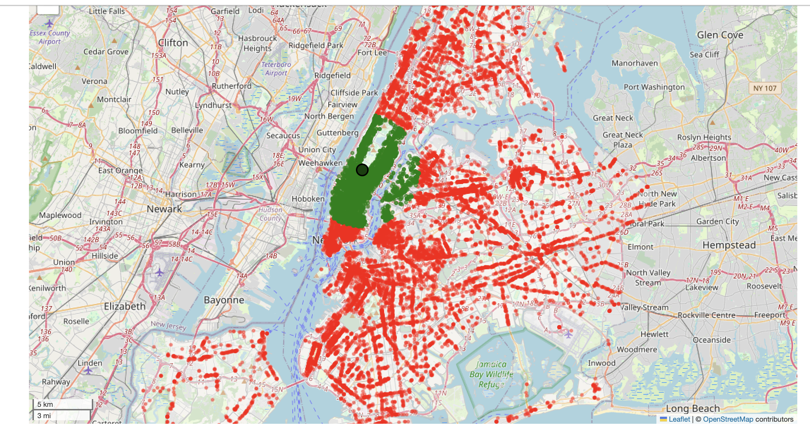
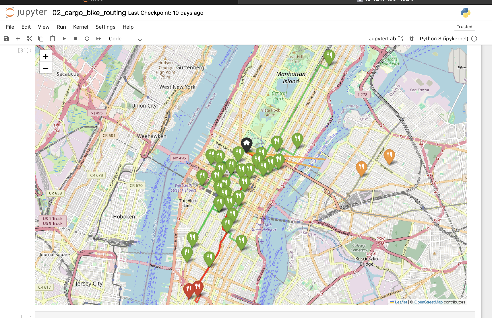
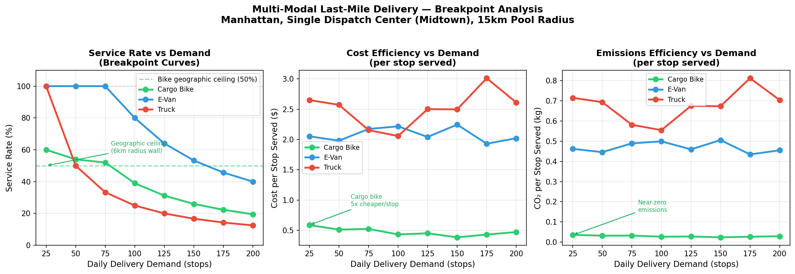
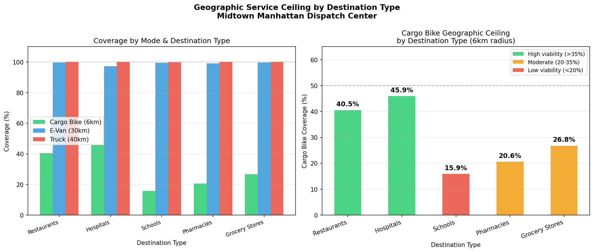

# Urban Delivery Routing Engine

A computational framework for analyzing multimodal last-mile delivery operations across urban environments — comparing cargo bikes, e-vans, and trucks on real NYC road network data to inform fleet mix decisions and sustainability policy.

## Overview

This project models and compares the operational performance of three last-mile delivery modes — cargo bikes, electric vans, and trucks — across urban delivery zones using real road network data. The framework evaluates routing efficiency, demand scaling behavior, and geographic service feasibility.

Built as part of research on sustainable urban logistics, with findings contributing to a **Springer book chapter on last-mile delivery optimization**.

## Key Findings

- **50% geographic ceiling** — cargo bikes dispatched from Midtown Manhattan can serve at most ~50% of NYC destinations due to borough boundary constraints
- **Destination viability varies dramatically** — hospitals (45.9%) and restaurants (40.5%) are high-viability; schools (15.9%) are low-viability for cargo bike deployment
- **5x cost advantage** — cargo bikes cost ~$0.50/stop vs. ~$2.00–3.00/stop for e-vans and trucks across all demand levels
- **Near-zero emissions** — cargo bikes produce <0.05 kg CO₂/stop vs. 0.4–0.8 kg for motorized modes
- Three distinct operational failure modes identified by vehicle type, directly informing multimodal fleet mix strategy

## Results & Visualizations

### Geographic Feasibility — Cargo Bike Coverage Across NYC
Dispatch from Midtown Manhattan (black dot). Green = within 6km feasibility range. Red = outside feasibility range. The ~50% geographic ceiling is clearly visible — cargo bikes serve a narrow Manhattan corridor but cannot reach most of Brooklyn, Queens, or the Bronx.

---

### Route Visualization — Cargo Bike Routing (Midtown Dispatch)
Green pins and routes = stops within feasibility range. Red = stops outside range. Each run randomly samples 35 destinations to model realistic dispatch conditions.

---

### Breakpoint Analysis — Service Rate, Cost & Emissions vs. Daily Demand
As daily delivery demand scales, cargo bikes hit their geographic service ceiling (~50%). E-vans maintain higher service rates at scale. Cargo bikes remain ~5x cheaper per stop and near-zero emissions at every demand level tested.

---

### Geographic Service Ceiling by Destination Type — Midtown Manhattan Dispatch
Cargo bike viability varies significantly by destination category. Hospitals (45.9%) and restaurants (40.5%) fall within the high-viability zone. Schools (15.9%) and pharmacies (20.6%) fall below the 20% threshold, indicating that fleet operators should route these deliveries to e-vans by default.

---

## Notebooks

| Notebook | Description |
|---|---|
| 01_exp_setup | Environment setup, network data loading, dispatch zone configuration |
| 02_cargo_bike_routing | Cargo bike route generation and feasibility analysis |
| 03_multimodal_routing | Comparative routing across cargo bike, e-van, and truck modes |
| 04_BREAKPOINT_ANALYSIS | Demand curve modeling and performance breakpoint detection |
| 05_DESTINATION_TYPE_ANALYSIS | Geographic service analysis by destination category |

## Methods

- Genetic algorithm with tournament selection and OX1 crossover for route optimization
- Distance matrix precomputation for computational efficiency (64× speedup)
- Demand scaling analysis across 25–200 stops/day
- Geographic feasibility modeling using OSMnx road network data
- Breakpoint curve analysis to identify mode performance thresholds

## Tech Stack

Python · Jupyter · GeoPandas · OSMnx · NetworkX · Shapely · Matplotlib · Folium

## Data

Road network data retrieved via OSMnx. Demand and destination data represent delivery zones across urban dispatch areas. Raw data files are not included. Run `01_exp_setup.ipynb` to initialize the network data pipeline.

## Status

Findings contributed to a Springer book chapter on last-mile delivery optimization. Analysis available for extension to additional dispatch centers and city networks.
